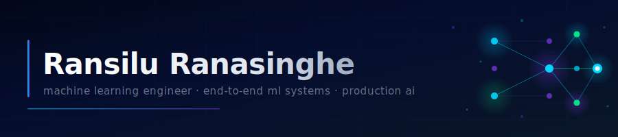

<!-- ═══════════════════════════════════════════════════════════
     BANNER — paste banner.svg into your repo root and it renders
     ════════════════════════════════════════════════════════════ -->

 

&nbsp;
&nbsp;

---

### 👋 Hi, I'm Ransilu

Machine Learning Engineer focused on **building production-ready ML systems** — not just training models.

I work across the full ML lifecycle: **data → modeling → evaluation → deployment → iteration**

> My approach is engineering-first: measurable performance over assumptions, clean testable code over experimentation chaos, systems that generalize rather than overfit.

---

### ⚙️ What I Work On

- 🔁 &nbsp;End-to-end ML pipelines for real-world, messy data
- 🚀 &nbsp;Backend APIs for low-latency model inference
- 🧮 &nbsp;Class imbalance, noisy labels, and distribution shift
- 📐 &nbsp;Model evaluation frameworks, tuning, and reliability
- 🗣️ &nbsp;Translating business requirements into ML solutions

---

### 🛠️ Tech Stack

**ML & AI**

**Backend & APIs**

**Data & Infrastructure**

---

### 📊 Development Insights

<!-- Stats card — shows commits, stars, PRs, issues -->

<!-- Language breakdown -->

  

<!-- Streak stats — reliable, self-hosted by demolab -->

---

### 📫 Find Me

---

I build ML systems that work beyond notebooks.

